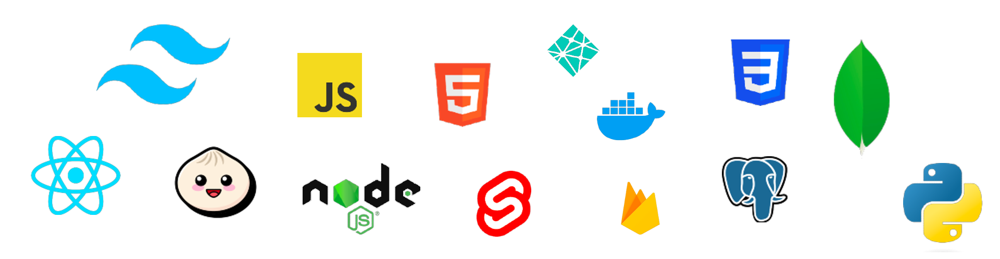

# Learn To Code · Roadmap 

#### The ultimate guide to *learning to code* & full stack development that will *land you a job* in no time 🔥

## Foreword

Hi,

I'm James, a self-taught software developer, and this guide is the roadmap I wish I had as I endeavored to learn programming with the ultimate goal of being employed as a software developer. Successful as I was, it was a journey fraught with peril and with the knowledge I have today, there aremany things I would do differently & better. You can learn more about my journey [here ->](https://www.youtube.com/watch?v=nP0-oYGiqts)
 
With this guide, hopefully you too can learn to code (even if you have no prior experience) and land your developer role! 

> If you're enjoying the guide, consider *staring ⭐️* & sharing the repo :P Or check out the interactive [version](https://www.roadmap.smoljames.com)🔥

## Resources

You're not alone in your journey, dive in to our coding community.

* **Youtube** -> https://www.youtube.com/smoljames
* **Discord** -> https://discord.gg/BYr6gujs4k
* **Course Notes** -> https://github.com/jamezmca/learn-to-code/tree/main/course%20notes

## Learning To Code (6 Chapters)

Finally, time for the good stuff 🎉

### Chapter 1 - HTML CSS & GIT

*Completion time **[10hrs]***

We begin our journey with HTML CSS & GIT. The first two are essentially the backbone of the internet, and are the perfect entry point for beginner developers. GIT on the otherhand, is a code version management that companies use to organize their work.

1. [HTML & CSS Full Course - Zero to Hero](https://www.youtube.com/watch?v=70T2GMDKl6M) *[1.5hrs]*

2. [Learn HTML & CSS - Build & Deploy a Linktr.ee Clone [Beginner Tutorial]](https://youtu.be/jKWGYVRAYnc) *[30mins]*

3. [How To Deploy A Website (to the internet)](https://youtu.be/NBrQp6-721c) *[4.5mins]*

4. [GIT Crash Course](https://youtu.be/WqWZt5gi-jw?si=reB1ABwV5Phus3pr) *[13mins]*

5. [Learn HTTPS Networking](https://www.youtube.com/watch?v=fA0IBFiKaPE) *[14mins]*

#### Course Notes

Summary notes and reference material can be found here ->

* [HTML & CSS Survival Guide](https://github.com/jamezmca/learn-to-code/blob/main/course%20notes/html_css.md)
* [GIT & GitHub Survival Guide](https://github.com/jamezmca/learn-to-code/blob/main/course%20notes/git_github.md)

#### End of Chapter Project

Build your first ever Single Page Application (SPA) - a portfolio website showcasing your coding skills! Using only HTML and CSS, create a responsive website with sections for introducing yourself, listing your skills and projects, and providing contact details. Don't hesitate to experiment with design and interactive elements (it doesn't need to be perfect).

> **After completing a tutorial or project**, share your work on Twitter, LinkedIn or in the [Discord](https://discord.gg/BYr6gujs4k) channel and tag me too so everyone can be inspired by your success :P

### Chapter 2 - JavaScript

*Completion time **[10hrs]***

JavaScript is the most popular programming language in the world and is brilliant for both frontend and backend development.

1. [FreeCodeCamp JavaScript Algorithms & Data Structures](https://www.freecodecamp.org/learn/javascript-algorithms-and-data-structures/) *[-/- hrs]*

2. [How to use JavaScript in Web Development?](https://youtu.be/0GWNq9Cra60) *[10mins]*

3. [Build & Deploy an Unreasonably Good ToDo Web App w. HTML CSS JavaScript](https://youtu.be/OulQ9W2s6Z0) *[34mins]*

#### End of Chapter Project

Ready to combine your passion for food and coding? Build an interactive Single Page Application (SPA) - your own recipe book! Using HTML, CSS, and JavaScript, create a responsive app with recipe lists, detailed instructions, and search functionality. Showcase your culinary creativity and explore data manipulation, user interaction, and SPA design. 

> **After completing a tutorial or project**, share your work on Twitter, LinkedIn or in the [Discord](https://discord.gg/BYr6gujs4k) channel and tag me too so everyone can be inspired by your success :P

### Chapter 3 - Frontend JavaScript Frameworks

*Completion time **[20hrs]***

JavaScript frameworks make building dynamic and interactive websites incredibly easy. There's loads to pick from but React.js is a great place to start!

1. [React Full Course - Zero to Hero](https://youtu.be/hRlujM-sycg) *[1hrs]*

2. [SvelteKit Web Portfolio](https://www.youtube.com/watch?v=ylCUH6LkW80) *[1.2hrs]*

3. [Learn NextJS 13: Build a Modern Full-Stack E-commerce App with TailwindCSS + Stripe + Zustand](https://www.youtube.com/watch?v=oLPgc5Fp2Ts) *[1.5hrs]*

4. [Learn Qwik - The World's Fastest JavaScript Web Framework](https://youtu.be/4a75F4FEArs?si=GUWyU8qb8aMZYiVU) *[1.5hrs]*

#### End of Chapter Project

Dive into the world of dynamic weather with React! Build a user-friendly dashboard displaying current conditions and forecasts for any location. Utilize React components, state management, and API integration to bring weather data to life with informative visuals and interactive features. Showcase your React mastery and share your stunning weather app with the world!

> **After completing a tutorial or project**, share your work on Twitter, LinkedIn or in the [Discord](https://discord.gg/BYr6gujs4k) channel and tag me too so everyone can be inspired by your success :P

### Chapter 4 - Backend Server Frameworks

*Completion time **[20hrs]***

If you're looking to extend your capabilites beyound Frontend development into Full Stack development, then it's time to explore some Backend tech!

1. [Node.js + Express.js Crash Course - Zero to Hero](https://youtu.be/V8ePZHOjRQo) *[1hrs]*

2. [Monetise an API with Stripe Node.js & Firebase](https://youtu.be/Wy9aOFcpr0w) *[1.5hrs]*

3. [Dockerized Node.js & PostgreSQL Tutorial](https://youtu.be/sDPw2Yp4JwE) *[26mins]*

#### End of Chapter Project

Take your first steps in backend development with a simple "To-Do List" app! Build an API with Node.js and Express to add, list, and mark tasks as complete, all while utilizing in-memory data storage and basic error handling.

> **After completing a tutorial or project**, share your work on Twitter, LinkedIn or in the [Discord](https://discord.gg/BYr6gujs4k) channel and tag me too so everyone can be inspired by your success :P

### Chapter 5 - Databases (SQL & NoSQL)

*Completion time **[10hrs]***

It's time to persist data - all the data... all of it!

1. [Mongo.db Tutorial](https://www.freecodecamp.org/learn/back-end-development-and-apis/mongodb-and-mongoose/install-and-set-up-mongoose) *[-/- hrs]*

2. [Node.js & Firebase Firestore Tutorial](https://youtu.be/LefcqnZHYeg) *[13mins]*

3. [FreeCodeCamp SQL Tutorial](https://www.freecodecamp.org/learn/relational-database/) *[-/- hrs]*

#### End of Chapter Project

Build a backend API with Node.js, Express.js & PostgreSQL that manages a stores inventory! Actions should include being able to read, add, update & delete items - basically all the standard CRUD operations, and also allow the owner to manage stock levels & quantities.

> **After completing a tutorial or project**, share your work on Twitter, LinkedIn or in the [Discord](https://discord.gg/BYr6gujs4k) channel and tag me too so everyone can be inspired by your success :P

### Chapter 6 - Full Stack Development

*Completion time **[10hrs]***

This chapter will help us to synthesise all our knowledge together under the branch of programming known as **Full Stack Development**. We'll learn how we can integrate all of the systems we've learned to far to build and deploy amazing web applications for just about purpose or application.

1. [Passing Data Between Frontend and Backend | Node.js](https://youtu.be/5TxF9PQaq4U?si=m9x28RVUwvpJPHSv) *[20mins]*

2. [Learn Next.js by building a full-stack CRUD app | Nextjs + Firebase (Auth & Firestore) + TailwindCSS](https://youtu.be/UzMr7-0FgA0?si=K3xYlI_Kr2SeVokQ) *[2hrs]*

3. [Learn SvelteKit by building a Full Stack CRUD app | SvelteKit & Firebase (Auth + DB)](https://youtu.be/TIbL0VOE900?si=jY39HeeJ8F_O__Ou) *[1.33hrs]*

## Projects

Now that you've got the knowledge you need to start building some wicked full stack web applications, here's my recommendation for the best trio of projects to include in your web portfolio.

**Projects do not need to be overly complex, just clean and well coded**

### Recommended

1. [Web portfolio](https://youtu.be/ylCUH6LkW80) -> You'll need somewhere to store you work.
*Recommended to use a JavaScript framework combined with TailwindCSS*

2. Frontend Framework (e.g. React.js or Next.js) that consumes an API (weather app, pokemon pokedex etc.).

3. An API project that uses the REST methodologies with Node.js, Express.js and PostgreSQL. Bonus points if you can contain it within a Docker Container and combine it with the ChatGPT API.

4. A Full Stack project using a frontend framework (React.js or SvelteKit), Firebase auth, Firebase Firestore database & TailwindCSS. This could be a calender app, a todo app, or even a recipe app.

> **After completing a tutorial or project**, share your work on Twitter, LinkedIn or in the [Discord](https://discord.gg/BYr6gujs4k) channel and tag me too so everyone can be inspired by your success :P

### Additional Projects

* **Full Stack Projects**
    - [An E-Commerce Store in Next.js + Stripe + TailwindCSS](https://youtu.be/rbMvm-CrkOA)
    - [A Full SEN Stack Project (Svelte, Express, Node.js)](https://youtu.be/oYQ61tmphYc)
    - [A Node.js + HTML + CSS + Firebase Full Stack Poll App](https://youtu.be/qLUTHVf2mF4)
* **Frontend Project**
    - [A Data Visualisation Website (that consumes a data API and presents metrics that the user can interact with, for example a Covid Stats Website)](https://youtu.be/tYcjZomsFkY)
    - [A React app that consumes an API, displays data, and has a responsive design](https://youtu.be/hRlujM-sycg)
    - [Build a React web portfolio that is designed by AI](https://youtu.be/Gh4SeWGEHKg)
* **Backend Project Recommendations**
    - [A Web Scraper Server (that stores data provides it as an API)](https://youtu.be/37LJxWzjy6g)
    - [A CRON Job Server (Completes a task at a given interval)](https://youtu.be/TJ_celb19Ko)
    - [Something Serverless -_-](https://youtu.be/FZHyHQ6ytZM)

## Land a Job

Everything you could ever want to know about landing your software developer job can be found <kbd>**[here ->](https://www.roadmap.smoljames.com/blog/job_applications)**</kbd>

### [I WANT A JOB 🔥](https://www.roadmap.smoljames.com/blog/job_applications)

*This part cannot be understated and is equally important as the entirety of the learning to code section!*

## Extra For Experts

To make the process a hint more fun and engaging, there's a few extracurricular activities happening on the regular that you might wish to participate in! 

* **Builder Streams** -> Weekly streams @ **2pm EDT** time where we'll spend some time developing projects and doing other programming related things!
* **Project Feedback** -> Get feedback and assistance on your project in the *#share-your-projects* channel in the Discord.
* **Mock Interviews** -> Practice your interview skills with some mock interviews (they might get uploaded to the channel so be prepared :D).
* **Coding Battles** -> Nothing like a challenge and in the coding battles we'll see who can program different things faster.

## Final Words

This journey can be challenging, even at the best of times. But with some patience & consistency you can absolutely become an extremely capable developer and have a successful career in tech, or just build hella bomb projects for the memes - it's up to you :P There's loads of us on this path together so just keep in mind that there's always a community here to support you along the way and we're pretty active in the Discord chat if you want to come hang out!

Cheers,

James

[LinkedIn](https://www.linkedin.com/in/jamezmcarthur/) · [Twitter](https://twitter.com/_Smoljames) · [Newsletter](https://smoljames.beehiiv.com/subscribe)